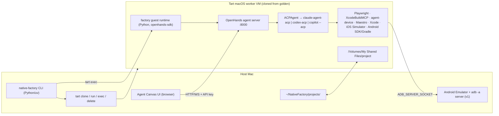

# Native Factory — Handoff to the implementing agent

Reviewed 2026-09-19 against current upstream documentation. Read this together with
`Native Factory — Engineering Brief.md` (the brief). Where the two disagree, this
file wins. The brief's "First task" step 1 (research) and step 4 (find incorrect
assumptions) are done here; do not repeat them, but do resolve the items in
section 8 empirically.

---

## 1. Host facts (measured)

| Item | Value |
|---|---|
| Chip | Apple M5 Max |
| macOS | 26.5.2 (Xcode 27 needs 26.6+; pin Xcode 26.x or upgrade host) |
| RAM / free disk | 128 GB / 2.7 TB |
| Installed | node 24.5, uv, pyenv python 3.9.5 (too old, let uv manage 3.12+) |
| Not installed | Tart, Go, Android SDK, Xcode CLI tools not checked |

## 2. Decisions already made by the user

1. Host CLI language: **Python 3.12+ managed by uv**. The in-guest factory runtime
   is Python anyway (OpenHands SDK), so one language for contributors. Record a
   one-paragraph Go comparison in `docs/architecture.md`; do not reopen it.
2. **iOS and Android are both required.** Tart is kept only because the design in
   section 4.5 keeps Android working. Dropping Tart is a sanctioned last resort,
   not a first move.
3. **Add callstack/agent-device** to the toolchain with the role split in 4.9.
4. No remote git, no Homebrew packaging, no GUI in early milestones (unchanged).

## 3. Verdict in one paragraph

The brief's central architecture holds: OpenHands Agent Canvas exists, is an ACP
client, and drives Claude Code / Codex / Gemini out of the box. Three things must
change: (a) the Android Emulator cannot run inside a macOS guest VM on Apple
Silicon, so the emulator lives outside the guest; (b) OpenHands auto-approves all
ACP permission requests, so the VM boundary is the only isolation and the security
section must say so; (c) Tart moved to OpenAI with a new install tap, licence, and
command set, and the prebuilt Xcode image already contains the Android SDK and
JDK. Many smaller tool facts in the brief are stale and are corrected below.

## 4. Corrections to apply to the brief (by section)

### 4.1 Agent architecture — packages and split of responsibility
- Real names: `@openhands/agent-canvas` (npm; UI + backend launcher, port 8000,
  needs Node 22.12+ and uv, Docker optional); Python packages `openhands-sdk
  openhands-tools openhands-workspace openhands-agent-server`; SDK class
  `openhands.sdk.agent.ACPAgent(acp_command=[...])`.
- ACP adapters: Claude Code `npx -y @agentclientprotocol/claude-agent-acp`
  (maintained by the ACP org on the Claude Agent SDK; Claude Code has no native
  ACP); Codex `npx -y @agentclientprotocol/codex-acp`; Gemini
  `npx -y @google/gemini-cli --acp`; GitHub Copilot is not a built-in OpenHands
  provider — use the Custom provider with `copilot --acp` (native, public preview).
- Split: the **factory runtime** (Python, uses `openhands-sdk`) owns the pipeline
  (inspect → spec → per-feature implement → evaluate → retry) and creates
  conversations on the **agent server running inside the guest**
  (`python -m openhands.agent_server --host 0.0.0.0 --port 8000`, auth via
  `OH_SESSION_API_KEYS_0` / `OH_SECRET_KEY`, or `agent-canvas --backend-only
  --public` with `LOCAL_BACKEND_API_KEY`). **Agent Canvas UI** runs in the host
  browser (`agent-canvas --frontend-only`, "Manage Backends" → guest URL + key)
  for observation and manual intervention. Provider adapters produce only:
  `acp_command`, env/secrets, and provider-native MCP config written into the
  workspace (e.g. `.mcp.json` for Claude Code, `config.toml` for Codex).
- `ACPAgent` does **not** accept `tools`, `mcp_config`, `condenser`, `critic`.
  Skills/repo context reach the ACP agent only as prompt text via `agent_context`.
- Fallback if OpenHands ever blocks: the factory can be its own headless ACP
  client with the Python `agent-client-protocol` package (runnable example in the
  ACP python-sdk repo). Do not build this unless needed.

### 4.2 Security — additions
- OpenHands **auto-grants every ACP permission request** and launches Claude Code
  in `bypassPermissions` (Codex in `agent-full-access`). Isolation comes only from
  the VM and the mount allow-list. State this explicitly.
- Prompt assembly must delimit observed website content as untrusted data
  (trusted instructions and untrusted observations travel in the same prompt text).
- Mount only `~/NativeFactory/projects/<name>` via `tart run --dir`; config
  read-only. Use `--net-softnet` with an allow-list when egress control is needed.
- Playwright MCP README: "not a security boundary". Origin filters and secret
  masking are conveniences.

### 4.3 Credentials
- Never bake logins into the golden image. Default the claude-code adapter to
  `ANTHROPIC_API_KEY` passed via `Conversation(secrets={...})` (SDK injects and
  masks). `CLAUDE_CODE_OAUTH_TOKEN` (from `claude setup-token`, 1-year
  subscription token) is opt-in; Anthropic's Agent SDK terms restrict third-party
  products offering claude.ai login, so document the caveat. Precedence inside
  Claude Code: env API key beats subscription login; `--bare` ignores the OAuth
  token. The SDK isolates Claude config with `CLAUDE_CONFIG_DIR` and strips
  `ANTHROPIC_API_KEY` when an OAuth token is present.
- Same pattern for `OPENAI_API_KEY` (Codex) and Copilot BYOK.

### 4.4 Tart — commands, licence, images
- Cirrus Labs joined OpenAI 2026-04-07. Install: `brew install openai/tools/tart`
  (+ `openai/tools/tart-guest-agent`, `openai/tools/softnet`). Licence
  FSL-1.1-ALv2 (converts to Apache-2.0 after 2 years; not OSI but unrestricted
  for this use). https://tart.run/licensing/ is stale. Apple SLA: max 2 macOS VM
  instances per Mac, dev/test or personal use only.
- Commands that exist: `tart clone` (APFS copy-on-write, near-instant),
  `tart run --no-graphics --dir=name:path[:ro] [--net-softnet] [--nested]
  [--suspendable]`, `tart exec [-i] [-t] <vm> <cmd>` (vsock via guest agent, env
  via `/usr/bin/env K=V cmd`), `tart ip <vm>`, `tart set <vm> --cpu --memory
  --disk-size`, `tart suspend`. Commands that **do not exist**: `tart ssh`,
  `--headless` (Packer option only). No live snapshots; clone → run → delete is
  the intended pattern.
- Mounts appear at `/Volumes/My Shared Files/<name>` in macOS guests. `tart exec`
  touching that path triggers a TCC prompt unless SIP is disabled in the image
  (official base/xcode images disable it; a vanilla-derived custom image hung).
- Concurrency: **max 2 macOS guests per host**; a third `tart run` fails. Linux
  guests are uncapped. "Concurrent workers" therefore means ≤ 2 features in
  flight, and the golden image must not be running alongside 2 workers.
- Nested virtualization: **Linux guests only**, M3+/macOS 15+. Tart throws for
  any macOS guest with `--nested`.
- Golden image: Packer + `packer-plugin-tart` with `vm_base_name =
  "ghcr.io/cirruslabs/macos-tahoe-xcode:<PINNED TAG>"`. Pin tags: `tahoe-xcode:
  latest` = 26.5 today; `sequoia-xcode:latest` = 16.4 despite 26.x tags existing.
  Image already contains: Xcode + all platforms, Homebrew, git, node@24, mise,
  openjdk@17, Android cmdline-tools, platform-tools, platforms;android-36,
  build-tools;36.0.0, NDK, tuist, fastlane, tart-guest-agent, SIP disabled, Metal
  shim (opt-in). Missing: Android `emulator` package and system images, Python
  beyond system, Playwright, Maestro, agent-device, XcodeBuildMCP, OpenHands, ACP
  adapters, `android` CLI. Built at 4 CPU / 8 GB; raise with `tart set`.
- Sizes: xcode image 69 GB compressed pull / 140 GB uncompressed disk; base 27 /
  50 GB. Budget ≈ 70 GB OCI cache + up to 140 GB sparse per worker. Doctor
  threshold: ~200 GB free.
- Credentials `admin`/`admin`, SSH on. No secret-injection feature: use `:ro`
  mounts, `tart exec` env, or SSH.

### 4.5 Android Emulator placement (critical)
- ARM64 AVDs require Hypervisor.framework; `-accel off` exists only for x86
  images; Google: "You can't run a VM-accelerated emulator inside another VM."
  Inside a Tart macOS guest the emulator fails with `HV_UNSUPPORTED` (Tart issue
  #881 closed not-planned; GitHub macOS runners and MacStadium document the same).
- Only the emulator leaves the guest. Android SDK, Gradle builds, unit tests,
  Roborazzi (JVM) stay in the guest.
- **v1 design**: emulator on the host (`android emulator start ...` or `emulator
  -no-window -no-audio -no-boot-anim -gpu swiftshader_indirect`), host adb server
  bound to the Tart NAT interface (`adb -a -P 5037 server nodaemon`, firewalled
  to 192.168.64.0/24). Guest exports `ADB_SERVER_SOCKET=tcp:<gateway>:5037` so
  Gradle install, agent-device, and Maestro reach the host emulator. Host gains
  emulator + platform-tools only.
- **Later**: same plumbing with the emulator in a Linux Tart guest using
  `--nested` (uncapped by the 2-VM limit); verify nested virt on M5 first.
- **Decision gate**: Milestone 6 opens with a one-day spike: from the guest,
  install an APK, run one Maestro flow, take one agent-device snapshot against the
  host emulator. Known unknown: whether Maestro's bundled adb client (dadb)
  honours `ADB_SERVER_SOCKET` / `ANDROID_ADB_SERVER_ADDRESS`. If the spike fails:
  fallback 1 = Android build + emulator on host with the agent still in the guest
  via the mounted `android/` dir; fallback 2 = drop Tart entirely (loses the only
  isolation layer; see 4.2).
- Config: `targets.android.emulator: host | linux-vm | host-fallback`.

### 4.6 Browser inspection — deterministic crawl, fixed APIs
- The discovery crawl is a **Playwright Node library script with no LLM in the
  loop**. LLM interpretation runs afterwards over the artefacts. Reserve
  Playwright MCP / `npx playwright cli` for agent-driven exploratory passes.
- Playwright 1.63 (Node ≥ 20). `page.accessibility.snapshot()` is **removed**;
  use `page.ariaSnapshot()` / `ariaSnapshotJSON({ mode: 'ai', boxes: true })`.
  HAR via `context.tracing.startHar()` or `recordHar`. Full-page screenshots
  unchanged. Use `devices['iPhone 15']` (393×659), `devices['iPhone 17']`
  (402×681), `devices['Pixel 8']` (412×839), `devices['Pixel 9']` (360×732) plus
  custom widths for breakpoint probing; keep the brief's viewport profile concept.
- Playwright MCP 0.0.82: no `--save-trace`; tracing is `--caps=devtools`.

### 4.7 iOS tooling
- XcodeBuildMCP 2.7.0 is now `github.com/getsentry/XcodeBuildMCP` (Sentry
  acquired it Feb 2026). Server: `npx -y xcodebuildmcp@latest mcp` (bare command
  is the CLI, usable from any agent's shell); `brew install
  getsentry/xcodebuildmcp/xcodebuildmcp`. Needs macOS 14.5+, Xcode 16+.
  `xcodebuildmcp-doctor` exists. Project creation: `scaffold_ios_project`
  (template repo XcodeBuildMCP-iOS-Template, default bundle prefix `io.sentry.*`
  — override). UI tool is `snapshot_ui` (not `describe_ui`). Underlying layer
  remains `xcodebuild` + `xcrun simctl`.
- swift-snapshot-testing 1.19.5 (Simulator; Swift Testing supported).
- Xcode 27 (2026-09-14) requires macOS 26.6+. Pin one Xcode and one Maestro and
  verify the pair in the golden image.

### 4.8 Android tooling
- `sdkmanager` / `avdmanager` are deprecated in favour of the first-party
  `android` CLI: `android sdk install|list`, `android emulator create|start|
  stop`, and **`android create --name=<app> --output=<path>`** (template
  `empty-activity-agp-9`) — the Compose scaffolder; no home-grown template.
- AGP 9.4 needs Gradle 9.6+ and JDK 17; Gradle current 9.7.1; API 36/37 images.
- Roborazzi 1.74.0 (JVM/Robolectric, no emulator) for visual baselines.

### 4.9 Testing — add agent-device, fix Maestro
- **agent-device** (callstack, MIT, Node 22.12+): CLI, MCP server
  (`agent-device mcp`), Node API. iOS Simulator via accessibility bridge + XCTest,
  Android via ADB. Commands: `open`, `snapshot` (a11y tree with refs), `press`,
  `fill`, scroll/gesture/wait/assert, `screenshot`, logs, video, traces, network,
  crash details; saves `.ad` replay scripts; exports strict Maestro YAML.
- Role split: **XcodeBuildMCP** = project discovery, build, test, simulator
  lifecycle, logs. **agent-device** = interaction + evidence on both platforms
  (the worker's inner loop while implementing; plain CLI so it works for any ACP
  provider without MCP config). **Maestro** = canonical deterministic journey
  runner; agent-device explorations exported to Maestro YAML and committed.
  **SnapshotTesting / Roborazzi** = native visual baselines.
- Maestro CLI 2.10.0: Java 17+ required; `maestro studio` removed in 2.6 (Viewer
  web UI instead); `--headless` is web-only (headless = boot the simulator/emulator
  without a window); physical iOS unsupported; `maestro test --format junit
  --output <file>`; artifacts under `~/.maestro/tests/<ts>/`. iOS XCTest driver
  has recurring hang issues on new macOS/Xcode combos — pin and smoke-test.

### 4.10 Evaluation — addition
- Primary parity signal: compare native accessibility snapshots (agent-device)
  against web aria snapshots (Playwright) per screen and state. Screenshots stay
  secondary, as the brief already says.

### 4.11 Configuration — additions
`agent.auth: api-key | oauth-token`, `targets.android.emulator`, `xcode.version`,
`maestro.version`, `vm.base_image` (pinned tag), `vm.cpu`, `vm.memory_mb`.

### 4.12 CLI / doctor — additions
Host: macOS ≥ 26.6 if Xcode 27 image; Tart from the `openai/tools` tap; guest
agent formula; ≥ ~200 GB free; Android emulator + platform-tools when
`emulator: host`; adb server reachable from NAT. Guest: `xcodebuildmcp-doctor`,
agent-device, Maestro iOS driver smoke test, `android` CLI, agent server health.

### 4.13 Milestone 1 (detail)
Golden image = pinned `macos-tahoe-xcode:<tag>` + Packer layer installing: uv +
Python 3.12, Playwright + browsers, Maestro, agent-device, XcodeBuildMCP,
`@openhands/agent-canvas` + `openhands-sdk` stack, ACP adapters, `android` CLI,
factory guest runtime. `tart set` to ≥ 8 CPU / 16 GB. Acceptance tests:
1. `native-factory doctor` green on the host.
2. `native-factory vm create` produces the golden image from the Packer template
   reproducibly (second run is a no-op or identical).
3. `native-factory vm start` clones and runs `--no-graphics` with
   `--dir=project:<path>`; `native-factory vm shell` gives an interactive
   `tart exec -it` shell; `/Volumes/My Shared Files/project` is visible; no TCC
   prompt.
4. Guest `doctor` lists every tool with versions.
5. `native-factory vm stop` stops; stopped worker can be deleted or preserved.

## 5. Revised architecture sketch

## 6. Host and guest tooling lists (revised)

Host: Tart + guest-agent formula, `native-factory` CLI, config, workspace,
Android emulator + platform-tools (v1 only), Agent Canvas frontend (browser).

Guest (golden image): everything in the brief's list, plus agent-device, `android`
CLI, OpenHands agent server + SDK, ACP adapters, uv/Python 3.12. Minus the Android
emulator.

## 7. Verified reference (sources)

- OpenHands Agent Canvas: https://docs.openhands.dev/openhands/usage/agent-canvas/overview , /setup , /architecture , /acp-agents , /backend-setup/vm ; ACP blog https://www.openhands.dev/blog/use-any-coding-agent-in-openhands-with-acp
- OpenHands SDK ACPAgent: https://docs.openhands.dev/sdk/guides/agent-acp ; agent server https://docs.openhands.dev/sdk/guides/agent-server/local-server ; example `software-agent-sdk/examples/01_standalone_sdk/40_acp_agent_example.py`; provider registry `openhands/sdk/settings/acp_providers.py`
- ACP: https://agentclientprotocol.com (schema v1.23.0, 2026-09-18); adapters https://github.com/agentclientprotocol/claude-agent-acp , https://github.com/agentclientprotocol/codex-acp ; Copilot https://docs.github.com/en/copilot/reference/copilot-cli-reference/acp-server
- Claude Code auth: https://code.claude.com/docs/en/authentication ; headless https://code.claude.com/docs/en/headless ; no native ACP: anthropics/claude-code#6686
- Tart: https://github.com/openai/tart (Run.swift, Clone.swift, Exec.swift), https://tart.run/faq/ , https://tart.run/integrations/packer/ , https://github.com/openai/tart/discussions/1144 , https://github.com/openai/tart/issues/881 , https://github.com/cirruslabs/tart/discussions/1054 , https://github.com/openai/tart/issues/1030 , https://cirruslabs.org/ , https://macstadium.com/blog/cirrus-labs-is-joining-openai
- Images: https://github.com/cirruslabs/macos-image-templates (templates/xcode.pkr.hcl, base.pkr.hcl)
- Apple SLA: https://www.apple.com/legal/sla/docs/macOSTahoe.pdf §2.B(iii)
- Android emulator acceleration: https://developer.android.com/studio/run/emulator-acceleration ; https://github.com/actions/runner-images/issues/9472 ; https://docs.macstadium.com/remote-desktop-vdi/configuration/android-virtual-devices
- Android CLI: https://developer.android.com/tools/agents/android-cli ; AGP 9.4 https://developer.android.com/build/releases/agp-9-4-0-release-notes
- Playwright: https://playwright.dev/docs/release-notes , https://playwright.dev/docs/aria-snapshots , https://github.com/microsoft/playwright-mcp (README), https://github.com/microsoft/playwright-mcp/issues/1479
- XcodeBuildMCP: https://github.com/getsentry/XcodeBuildMCP , https://github.com/getsentry/XcodeBuildMCP-iOS-Template , https://www.xcodebuildmcp.com/docs
- Maestro: https://docs.maestro.dev/maestro-cli/maestro-cli-commands-and-options.md , https://maestro.dev/blog/maestro-cli-v2-6-0 , https://github.com/mobile-dev-inc/maestro/issues/3137
- agent-device: https://github.com/callstack/agent-device , https://oss.callstack.com/agent-device/
- Visual: https://github.com/pointfreeco/swift-snapshot-testing , https://github.com/takahirom/roborazzi

## 8. Open items to resolve empirically on this host (do these during Milestone 1/6, not now)

1. Does Linux-guest nested virtualization work on M5 with Tart `--nested`? (Docs say M3/M4.)
2. Does Maestro's dadb honour `ADB_SERVER_SOCKET` / `ANDROID_ADB_SERVER_ADDRESS`? (Gates the 4.5 design.)
3. Does the Agent Canvas UI path prompt for ACP permissions, or inherit the SDK auto-approve?
4. Maestro iOS driver stability on the pinned Xcode/macOS pair inside the guest.
5. Whether the XcodeBuildMCP iOS template is pinned per release (pin manually if not).

## 9. Your first task (replaces the brief's "First task")

Before implementing anything:

1. Read the brief and this file. Do not redo the research in section 7.
2. Write `docs/architecture.md` (host/guest split, agent architecture with the
   factory-runtime/agent-server/Canvas split, ACP provider adapters, Android
   emulator placement with the decision gate, security model incl. auto-approve,
   Mermaid diagrams). Include the Python-vs-Go paragraph.
3. Write `docs/implementation-plan.md`: the brief's milestones 1–10 with the
   corrections above applied, the Milestone 6 spike as an explicit gate, and the
   2-VM concurrency ceiling reflected in Milestone 9.
4. Propose the repository structure (Python package layout for host CLI and
   guest runtime, Packer templates, JSON Schemas, docs, tests).
5. Propose Milestone 1 in detail with the acceptance tests in 4.13 expanded into
   runnable checks.
6. STOP and present the plan. Do not `git init`, install tools, or write code
   until Milestone 1 is approved.
