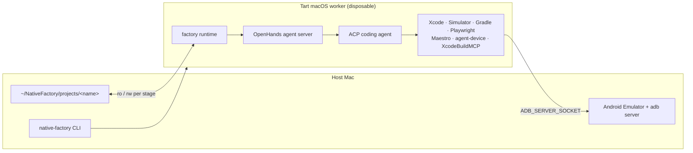

# Native Factory

A local software factory. It takes a running website as an executable reference product and
produces two genuinely native applications — Swift/SwiftUI for iOS and Kotlin/Compose for
Android — reproducing its functionality and product experience. Agents and mobile toolchains run
inside disposable [Tart](https://github.com/openai/tart) macOS virtual machines.

> **Status: Milestone 1, pre-alpha.** VM bootstrap only. There is no website discovery, no
> project generation and no `build` command yet. See
> [`docs/implementation-plan.md`](docs/implementation-plan.md).

## What it is not

Not a web-to-native transpiler. The website is observed as a product, not read as source. No
WebView shell, no cross-platform UI framework. Pixel-identical rendering is explicitly not a
goal; behavioural and product parity is.

## Requirements

- Apple Silicon Mac (M-series)
- macOS with [Tart](https://github.com/openai/tart) from the `openai/tools` tap
- ~250 GB free disk — the base Xcode image is ~69 GB compressed / ~140 GB on disk
- Python 3.12+ via [uv](https://docs.astral.sh/uv/)

Apple's macOS SLA permits **two** macOS VM instances per Mac, and Tart enforces the same limit.
Native Factory therefore runs at most two workers concurrently.

## Quick start

```bash
brew install openai/tools/tart openai/tools/tart-guest-agent
git clone <this repo> && cd native-factory
uv sync

uv run native-factory doctor          # check the host
uv run native-factory vm create       # build the golden image (60-90 min, one time)
uv run native-factory init myproject  # create a workspace
uv run native-factory vm start --project myproject --stage implement
uv run native-factory vm shell
```

## Architecture in one picture



The Android Emulator runs on the **host**, not in the guest: an ARM64 emulator needs
Hypervisor.framework and cannot be nested inside a macOS VM. Everything else — including the
Android SDK, Gradle builds and unit tests — stays in the guest. See
[`docs/adr/0002`](docs/adr/0002-android-emulator-outside-the-guest.md).

The coding agent sits behind [ACP](https://agentclientprotocol.com), so Claude Code, Codex,
Gemini or Copilot are interchangeable. No provider-specific logic exists outside
`providers/`.

## Security, stated plainly

**The VM is the only isolation boundary.** OpenHands auto-grants every ACP permission request
and launches the coding agent with permissions bypassed. The inspected website is untrusted
input and travels in the same prompt string as trusted instructions. Read
[`docs/architecture.md` §9](docs/architecture.md) before pointing this at anything you care
about, and use a dedicated, rotatable API key — never your primary one.

## Documentation

| | |
|---|---|
| [`docs/architecture.md`](docs/architecture.md) | the architecture of record |
| [`docs/implementation-plan.md`](docs/implementation-plan.md) | milestones 1–10 and acceptance tests |
| [`docs/adr/`](docs/adr/) | the decisions, with context and consequences |

## Development

```bash
uv sync
uv run ruff check .
uv run pyright
uv run pytest tests/unit tests/contract      # no VM required
uv run pytest -m vm tests/acceptance         # requires Tart on an Apple Silicon host
```

## Licence

Apache-2.0.
