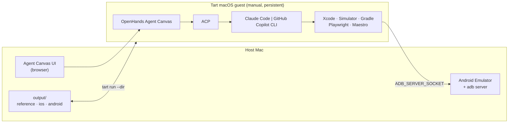

# Architecture — prototype

Status: prototype. See [`prototype-plan.md`](prototype-plan.md) for the plan and
[ADR-0007](adr/0007-prototype-first.md) for why this document is 150 lines rather than
600.

Native Factory takes a running website as a reference product and produces two genuinely
native applications — Swift/SwiftUI and Kotlin/Compose. An AI coding agent does the
building, inside a Tart macOS VM.

Not a transpiler. The website is observed as a product, not read as source. No WebView
shell, no cross-platform UI framework. Behavioural and product parity is the goal; pixel
fidelity is not.

## Shape



## The agent boundary

**ACP is the abstraction.** OpenHands is an ACP client and already selects between
providers; the factory adds nothing on top of that.

| Provider | How |
|---|---|
| Claude Code | OpenHands' built-in `claude-code` ACP provider (`acp_server`), which resolves `@agentclientprotocol/claude-agent-acp` via npx |
| GitHub Copilot | Custom ACP agent → `copilot --acp --stdio` (no built-in preset) |

The contract is narrow on purpose: *the selected agent can read and modify the workspace
and run the commands needed to build and test the applications*. Nothing else in the
repository knows which agent is running. The shared instructions live in
`prompts/build-native-apps.md`; provider-specific setup lives in documentation only.

The two are not expected to behave identically. They may use different tools and reach
the result differently. That is fine — it is the point of the seam.

An earlier version of this project built a provider-adapter layer in Python. It
duplicated what OpenHands already does and has been removed (ADR-0007). The one piece
worth remembering: inside Claude Code an environment API key beats a subscription login,
so passing both silently defeats an explicit choice of subscription auth.

## Authentication

Each agent's normal subscription login, performed interactively inside the VM, once.
**Verified 2026-09-22**: a full ACP conversation ran with no API key and no OAuth token
in the environment. The ACP subprocess inherits the guest's `HOME`, so it reads the
`~/.claude` session that `/login` wrote.

This is only possible because the prototype's VM is persistent. A disposable VM would
have to inject a credential on every run — which the agent could then read out of its own
environment, since it runs with permissions bypassed. Dropping disposability removed that
problem rather than solving it; it returns with automation.

## Android: the emulator is on the host

The one constraint the prototype cannot simplify away.

An ARM64 AVD requires Hypervisor.framework, and hardware acceleration cannot be nested
inside a macOS guest — the emulator fails with `HV_UNSUPPORTED`. Everything else Android
stays in the guest: SDK, Gradle builds, unit tests.

`scripts/adb-bridge.sh up` bridges the host's emulator in, with a forwarder on each side:

```text
host   adb on 127.0.0.1:5037,  socat <gateway>:5037 -> it
guest  socat 127.0.0.1:5037 -> <gateway>:5037
```

The guest-side half is the important one. adb cannot bind a single interface, and **AGP
ignores `ADB_SERVER_SOCKET` entirely** — Gradle hangs on "Cannot reach ADB server" however
the environment is set. Forwarding localhost inside the guest makes every client's
assumption true instead of asking each one to cooperate, so adb, Gradle and Maestro all
work with no environment variables at all.

Verified end to end on 2026-09-22: a Compose app built in the guest, installed on the host
emulator, launched, and passed a Maestro flow. `scripts/adb-bridge.sh verify` re-checks
all four clients.

Full reasoning and the fallback ladder:
[ADR-0002](adr/0002-android-emulator-outside-the-guest.md).

## Security, in one paragraph

The VM is the only isolation boundary. OpenHands auto-grants every ACP permission request
and launches the agent with permissions bypassed, and scraped website text travels in the
same prompt as the instructions. Treat everything under `output/reference/` as data, never
as directives — `prompts/build-native-apps.md` says so to the agent explicitly. Full
detail, including what a subscription credential exposes, in [`security.md`](security.md).

## VM

Created by hand, provisioned by `scripts/setup-guest.sh` so a broken VM is recoverable
without following prose instructions again. Tart caps macOS guests at **two** per host.
Commands, install traps and troubleshooting: [`vm.md`](vm.md).

## Readiness

`scripts/doctor.py` — one stdlib-only file, no package, no dependencies. `--guest` runs
the in-VM checks. Every failure carries a remediation line.

It survived the pivot on merit: it turned an opaque Homebrew error into a twenty-second
diagnosis, and it encodes two traps that cost real time — the legacy `android` script
that exits 0, and a version regex that read `v24.5.0` as `5.0`.
