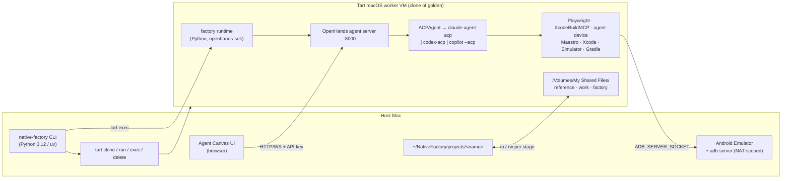
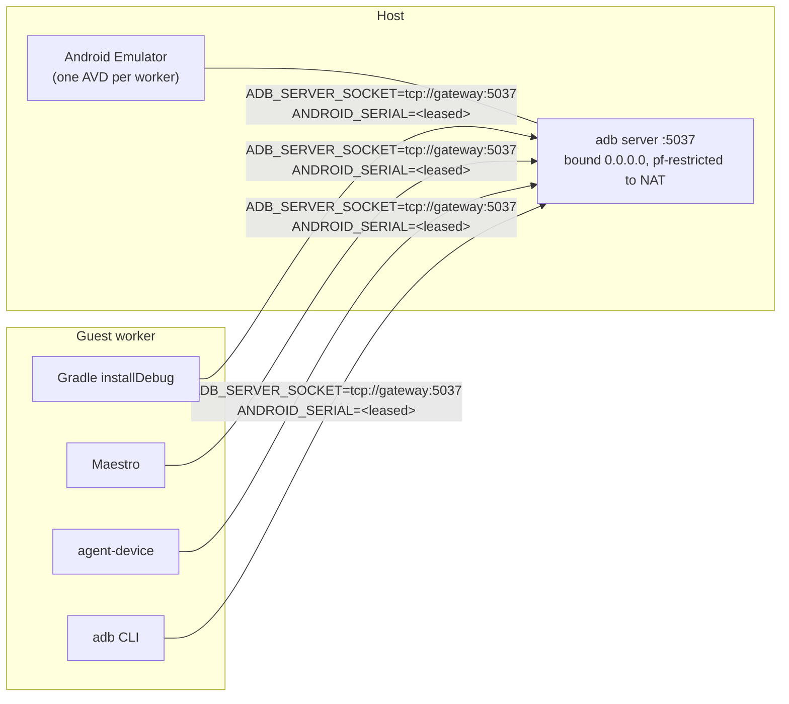
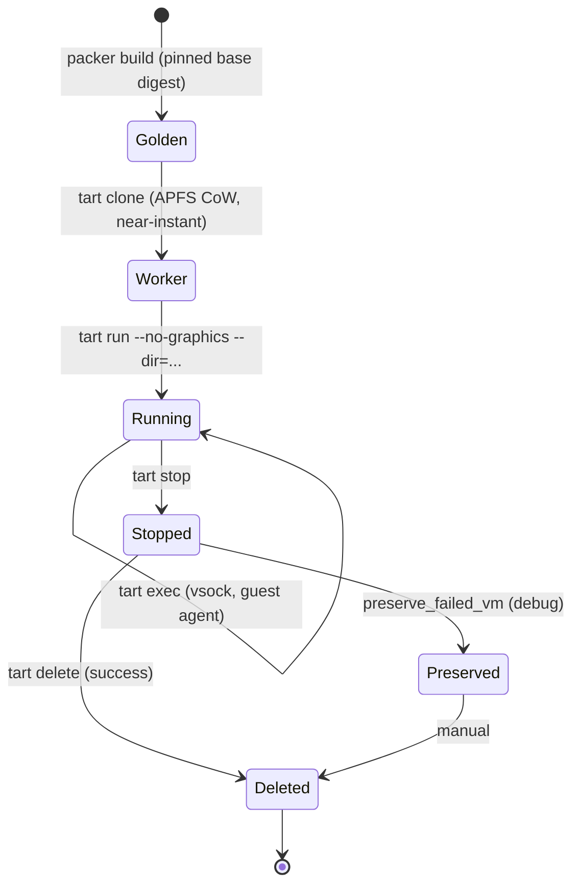
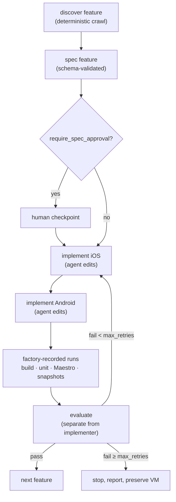

# Native Factory — Architecture

Status: design, pre-implementation. Written 2026-09-19.

Native Factory is a local software factory. It takes a running website as an executable
reference product and produces two genuinely native applications — Swift/SwiftUI for iOS and
Kotlin/Compose for Android — that reproduce the site's functionality and product experience.
Agents and mobile toolchains run inside disposable Tart macOS virtual machines.

This document is the architecture of record. It supersedes `Native Factory — Engineering
Brief.md` wherever the two disagree, and it applies the corrections in `HANDOFF.md`. Design
choices that differ from the brief cite the HANDOFF section that motivated them, in the form
(HANDOFF §4.5). Choices that differ from HANDOFF itself are marked **[deviation]** and carry
a rationale.

---

## 1. Purpose and priority order

The factory optimises, in this order (from the brief, unchanged):

1. **Reproducibility** — the same inputs produce the same environment and the same artefacts.
2. **Observability** — a human can understand what happened without reading an LLM transcript.
3. **Deterministic evaluation** — pass/fail is machine-readable and derived from recorded runs.
4. **Isolation** — agent execution cannot reach the host or the user's data.
5. **Replaceable agent provider** — Claude Code, Codex, Gemini or Copilot behind one seam.
6. **Autonomous capability** — last, and always bounded by retry limits and human checkpoints.

When two of these conflict, the earlier one wins. Most of the non-obvious decisions below fall
out of that ordering.

### What this is not

Not a web-to-native transpiler. The website is observed as a product, not read as source. No
WebView shell, no Kotlin Multiplatform, no shared-UI framework (brief). Pixel-identical
rendering is explicitly not a goal; behavioural and product parity is.

---

## 2. Host / guest split

The physical Mac holds as little factory-specific tooling as practical. Everything the agent
touches lives in a disposable VM.

| Concern | Host | Guest (Tart macOS worker) |
|---|---|---|
| `native-factory` CLI | ✅ Python 3.12 / uv | — |
| Factory runtime (pipeline) | — | ✅ Python, `openhands-sdk` |
| Tart, `tart-guest-agent`, `softnet` | ✅ `openai/tools` tap | — |
| Persistent workspace `~/NativeFactory` | ✅ source of truth | mounted, scoped |
| Agent Canvas **UI** | ✅ host browser | — |
| OpenHands **agent server** | — | ✅ `:8000` |
| ACP coding agent | — | ✅ |
| Xcode, iOS Simulator | — | ✅ from base image |
| Android SDK, JDK, Gradle | — | ✅ from base image |
| **Android Emulator** | ✅ **v1** (HANDOFF §4.5) | ❌ cannot work — see §6 |
| `adb` server | ✅ listening, NAT-scoped | client only, remote |
| Playwright + browsers | — | ✅ |
| Maestro, agent-device, XcodeBuildMCP | — | ✅ |

Two host tools exist only because of the Android emulator constraint: `emulator` and
`platform-tools`. Everything else on the host is Tart, Python and the workspace.

### Measured host baseline

This host (2026-09-19) is Apple M5 Max, macOS 26.5.2, 128 GB RAM, 2.7 TB free. It already has
uv 0.10.4, Node 24.5, Homebrew, Xcode 26.6, Java 17, and a full Android SDK at
`~/Library/Android/sdk` with four AVDs including `Pixel_9_API_36`.

**[deviation]** HANDOFF §1 lists the Android SDK as not installed and Xcode CLI tools as
unchecked. Both are wrong; the SDK is present and Xcode 26.6 is installed. This matters because
the §4.5 host-emulator design needs only `emulator` + `platform-tools` on the host, and they are
already here — which is why the Android plumbing spike moves into Milestone 1 rather than
Milestone 6.

One caveat it creates: the installed `platform-tools` is **33.0.1 (2022)**. Remote-adb
behaviour has changed since; doctor requires ≥ 35.

---

## 3. Agent architecture

Three components, deliberately separated (HANDOFF §4.1).

**Factory runtime** — Python, in the guest, built on `openhands-sdk`. Owns the pipeline:
inspect → spec → per-feature implement → evaluate → bounded retry. It creates conversations
against the agent server and it invokes the recorded build/test commands itself (§4).

**OpenHands agent server** — in the guest, `python -m openhands.agent_server --host 0.0.0.0
--port 8000`, authenticated with `OH_SESSION_API_KEYS_0` / `OH_SECRET_KEY`. Owns conversations
and the ACP subprocess lifecycle.

**Agent Canvas UI** — runs in the **host** browser (`agent-canvas --frontend-only`, "Manage
Backends" → guest URL + key). Observation and manual intervention only; the pipeline never
depends on it. Nothing about the factory requires a GUI (brief).



### The ACP provider seam

`openhands.sdk.agent.ACPAgent(acp_command=[...])` is the only place a provider is named. A
provider adapter produces exactly three things and nothing else:

1. `acp_command` — the argv of the ACP adapter binary.
2. environment and secrets — passed via `Conversation(secrets={...})`.
3. provider-native MCP configuration written into the workspace (`.mcp.json` for Claude Code,
   `config.toml` for Codex) — only when an MCP server is genuinely needed (see §5).

| Provider | ACP command | Notes |
|---|---|---|
| Claude Code | `claude-agent-acp` | `@agentclientprotocol/claude-agent-acp`, maintained by the ACP org on the Claude Agent SDK. Claude Code has **no native ACP** (HANDOFF §4.1). |
| Codex | `codex-acp` | `@agentclientprotocol/codex-acp` |
| Gemini | `gemini-cli --acp` | `@google/gemini-cli` |
| GitHub Copilot | `copilot --acp` | native, public preview; **not** a built-in OpenHands provider — use the Custom provider (HANDOFF §4.1) |

**[deviation]** HANDOFF §4.1 gives these as `npx -y @agentclientprotocol/claude-agent-acp`.
`npx -y` resolves and downloads at invocation, so a "reproducible" golden image would depend on
npm reachability and on whatever version is latest at run time. The image instead installs each
adapter globally at a **pinned version** recorded in the image manifest, and `acp_command` points
at the installed binary. Same architecture, no network dependency, no version drift. See
ADR-0003.

### Constraints the seam imposes

`ACPAgent` does **not** accept `tools`, `mcp_config`, `condenser` or `critic` (HANDOFF §4.1).
Consequences the factory must live with:

- Repository context, skills and instructions reach the agent **only as prompt text**, via
  `agent_context`. There is no structural channel.
- Because there is no structural channel, there is no structural separation between trusted
  instructions and untrusted observed website content either. They travel in the same string.
  This is the root of the security model in §9.
- Tool availability differs per provider unless tools are plain CLIs. This drives §5.

**Fallback, named but not built:** if OpenHands ever blocks the pipeline, the factory can act as
its own headless ACP client using the Python `agent-client-protocol` package (HANDOFF §4.1). Do
not build this speculatively.

---

## 4. Who runs what: the execution line

**[deviation]** Neither the brief nor HANDOFF states this explicitly, and the whole evaluation
story depends on it.

The brief requires machine-readable evaluation and that a user "understand what happened without
reading an LLM transcript". If the coding agent runs the builds, the factory only ever receives
the agent's *prose about* the build. Exit codes, JUnit XML and parsed diagnostics are lost.

So the line is drawn here:

| | Owner |
|---|---|
| Editing source files | **Agent** |
| Running builds/tests freely for its own feedback | **Agent** (unrecorded, unlimited) |
| The **recorded** build, test, journey and snapshot runs | **Factory runtime** |

The factory runtime invokes these directly and captures exit code, stdout/stderr and structured
output:

- `xcodebuild` / `xcrun simctl` (via the XcodeBuildMCP CLI, §5)
- Gradle tasks (`assembleDebug`, `testDebugUnitTest`, `installDebug`)
- `maestro test --format junit --output <file>`
- SnapshotTesting and Roborazzi runs

Only factory-recorded results enter the evaluator, the run record and `native-factory status`.
Agent narration is logged but never scored. See ADR-0004.

---

## 5. Tooling role split

From HANDOFF §4.9, with one extension.

| Tool | Role |
|---|---|
| **XcodeBuildMCP** 2.7.0 (`getsentry/XcodeBuildMCP`) | project discovery, build, test, simulator lifecycle, logs. `scaffold_ios_project` for project creation (override the default `io.sentry.*` bundle prefix). UI inspection is `snapshot_ui`, not `describe_ui`. Underneath: `xcodebuild` + `xcrun simctl`. |
| **agent-device** (callstack, MIT) | interaction and evidence on **both** platforms — `open`, `snapshot` (a11y tree with refs), `press`, `fill`, gestures, `screenshot`, logs, video, traces, network, crash details. The worker's inner loop while implementing. Exports strict Maestro YAML. |
| **Maestro** 2.10.0 | the canonical deterministic journey runner. agent-device explorations are exported to Maestro YAML and committed. |
| **SnapshotTesting** 1.19.5 / **Roborazzi** 1.74.0 | native visual baselines. Roborazzi is JVM/Robolectric and needs no emulator — which is why it is also the Android fallback rung in §6. |

### Prefer CLIs over MCP servers

**[deviation]** HANDOFF §4.9 justifies agent-device as "plain CLI so it works for any ACP
provider without MCP config". That argument applies at least as strongly to XcodeBuildMCP, whose
bare command is itself a CLI (HANDOFF §4.7) — and more so, because §4.1 establishes that
`ACPAgent` accepts no `mcp_config`, so every MCP server must be wired through provider-native
config files that the adapter writes per provider.

Therefore: **the factory uses the XcodeBuildMCP CLI, not its MCP server**, for everything in the
pipeline. This collapses the per-provider adapter surface to approximately zero and directly
serves the "no Claude-specific logic in the factory" constraint. The MCP server is reserved for
interactive Agent Canvas sessions where a human is driving. See ADR-0003.

---

## 6. Android emulator placement

This is the single largest architectural constraint in the system (HANDOFF §4.5).

### Why it cannot live in the guest

ARM64 Android system images require Hypervisor.framework. `-accel off` exists only for x86
images. Google states plainly that a VM-accelerated emulator cannot run inside another VM.
Inside a Tart macOS guest the emulator fails with `HV_UNSUPPORTED` (Tart issue #881, closed
not-planned; GitHub macOS runners and MacStadium document the same).

**Only the emulator leaves the guest.** The Android SDK, Gradle builds, unit tests and Roborazzi
(JVM) all stay in the guest.

### v1 design: emulator on the host, adb over the Tart NAT



Operational details that HANDOFF §4.5 leaves implicit:

- **`adb -a` binds `0.0.0.0`.** adb cannot bind a single interface. "Bound to the Tart NAT
  interface" is achievable only by firewalling: a root-loaded **pf anchor** restricting port
  5037 to `192.168.64.0/24`. The macOS Application Firewall cannot express this.
- **The guest must discover the gateway from its default route.** Do not hardcode
  `192.168.64.1`; Tart's vmnet subnet is not guaranteed.
- **Device arbitration is required.** §4.4 allows two concurrent macOS guests; §4.5 gives them
  one adb server and one emulator pool with no arbitration. `adb install`, Gradle
  `installDebug`, Maestro and agent-device all default to "the connected device" and will
  collide. The design is a **device lease**: one AVD per worker, its serial pinned per run via
  `ANDROID_SERIAL`, leases recorded in the host state DB. Cheap now, painful to retrofit. See §8
  and ADR-0002.

Configuration switch: `targets.android.emulator: host | linux-vm | host-fallback`.

### The decision gate

**[deviation]** HANDOFF §4.5 opens Milestone 6 with a one-day spike to validate this. That
places five milestones of work on top of an unverified assumption, and a failure would reopen the
emulator placement, the config schema and the worker concurrency model after the fact. The spike
runs at the **end of Milestone 1** instead. It needs only a booted guest, the host emulator and a
prebuilt APK — all of which exist at M1 — and this host already has the SDK and AVDs (§2).

The gate tests three independent ADB clients, not one:

| Client | Question |
|---|---|
| adb CLI | does `ADB_SERVER_SOCKET` reach the host emulator at all? |
| **AGP / adblib** | does Gradle `installDebug` honour it? |
| **Maestro (dadb)** | does the bundled dadb client honour it? (HANDOFF §8 item 2) |
| **agent-device** | does its ADB client honour it? |

**[deviation]** HANDOFF §8 lists only the Maestro question. AGP and agent-device make the same
assumption and are equally capable of failing it.

### Fallback ladder

**[deviation]** HANDOFF §4.5 gives "fallback 2 = drop Tart entirely". Tart is the only isolation
layer (§9) and the source of reproducibility and disposability for *all* work — iOS, discovery
and agent execution. Discarding it because Android emulator plumbing failed trades the entire
security model for one platform's end-to-end tests. (HANDOFF §2.2's framing — "Tart is kept only
because §4.5 keeps Android working" — inverts the dependency: Android is what Tart makes hard,
not what justifies it.)

Isolation-preserving ladder, in order:

| Rung | Fallback | What it costs |
|---|---|---|
| 1 | Android build + emulator on host; agent stays in the guest via the mounted `android/` dir | Android build reproducibility |
| 2 | **Android E2E degrades to JVM level — Robolectric + Roborazzi; emulator journeys unsupported** | Android on-device journey fidelity |
| 3 | Physical Android device attached to the host over USB | Nothing architectural; adds hardware |
| 4 | Drop Tart | Isolation, reproducibility, disposability — genuine last resort |

### Later: emulator in a Linux guest

Same plumbing, emulator inside a Linux Tart guest using `--nested` (Linux guests are uncapped by
the 2-VM ceiling). Tart throws for any macOS guest with `--nested`, and the docs claim M3/M4 —
M5 is unverified. Milestone 1 probes it; the result is informational and gates nothing.

---

## 7. VM lifecycle



Only documented Tart commands are used (HANDOFF §4.4): `clone`, `run`, `exec [-i] [-t]`, `ip`,
`set --cpu --memory --disk-size`, `stop`, `suspend`, `delete`, `list`.

**Commands that do not exist** and must never appear in the codebase: `tart ssh`, `--headless`
(that is a Packer option), live snapshots. The intended pattern is clone → run → delete.

Environment for `tart exec` is passed as `/usr/bin/env K=V cmd`.

`native-factory vm shell` prefers `tart exec -it`; if the guest agent is unavailable it falls
back to SSH via `tart ip` (credentials `admin`/`admin` in the official images).

### Hard ceiling: two macOS guests

A third `tart run` of a macOS guest **fails**. This is a platform limit, and Apple's macOS SLA
§2.B(iii) independently caps it at two VM instances per Mac for development/test use. Linux
guests are uncapped.

Consequences, designed in from Milestone 1 rather than discovered at Milestone 9:

- "Concurrent workers" means **at most two features in flight**.
- The golden image cannot be rebuilt while two workers run.
- The CLI refuses a third `vm start` **before invoking Tart**, with a message naming the limit
  and listing the running VMs.

### Golden image

Packer + `packer-plugin-tart`, layered on `ghcr.io/cirruslabs/macos-tahoe-xcode` pinned **by
digest, not tag** (HANDOFF §4.4 warns that `sequoia-xcode:latest` is 16.4 despite 26.x tags
existing — tags lie).

Already in the base image: Xcode + all platforms, Homebrew, git, node@24, mise, openjdk@17,
Android cmdline-tools, platform-tools, `platforms;android-36`, `build-tools;36.0.0`, NDK, tuist,
fastlane, `tart-guest-agent`, SIP disabled, Metal shim.

The factory layer adds: uv + Python 3.12, Playwright + browsers, Maestro (pinned), agent-device,
XcodeBuildMCP, the `openhands-sdk`/`-tools`/`-workspace`/`-agent-server` stack in
`/opt/native-factory/venv`, `@openhands/agent-canvas`, pinned ACP adapters, the first-party
`android` CLI, and the `native-factory-guest` wheel.

**Deliberately absent:** the Android `emulator` package and system images (§6). Their presence
in a built image is an error, and the guest doctor asserts it.

Built at 4 CPU / 8 GB; raised to 8 CPU / 16 GB via `tart set` (HANDOFF §4.13), config-driven.

**Reproducibility, stated honestly.** **[deviation]** HANDOFF §4.13 asks that a second
`vm create` be "a no-op or identical". Packer + Tart is neither idempotent nor bit-reproducible —
a rebuild re-runs Homebrew and npm, and images differ by timestamp alone. Reproducibility is
therefore expressed as **pinned inputs with a verifiable manifest**: `/opt/native-factory/
manifest.json` records the base image digest, every installed tool version, and the SHA-256 of
the Packer template and provisioning scripts. Two builds from the same `versions.lock.json` must
produce equal manifests apart from build timestamp and image digest. Separately, a second
`vm create` detects the existing image and exits 0 without rebuilding unless `--force`. See
ADR-0005's sibling discussion in the implementation plan.

### Disk budget

xcode image ≈ 69 GB compressed pull / 140 GB uncompressed; base ≈ 27 / 50 GB. Budget ≈ 70 GB OCI
cache plus up to 140 GB sparse per worker. **[deviation]** HANDOFF §4.4 sets the doctor threshold
at ~200 GB; that is a one-worker floor. With two workers plus the OCI cache the realistic floor
is **250 GB**, which is what doctor enforces.

---

## 8. Workspace and mounts

VMs are disposable; project output is not.

```text
~/NativeFactory/
    state.db                      # run + feature + device-lease state (SQLite)
    config.yaml                   # global config
    projects/
        example/
            native-factory.yaml   # project config
            reference/            # the product reference model (discovery output)
            work/
                ios/              # generated Xcode project
                android/          # generated Gradle project
            reports/              # evaluation + run artefacts (never mounted)
            factory/              # per-project factory state
```

Mounts use `tart run --dir=name:path[:ro]` and appear in the guest at
`/Volumes/My Shared Files/<name>`. Only the project directory is exposed — never the home
directory, never host SSH or cloud credentials (brief).

Touching that path from `tart exec` triggers a TCC prompt unless SIP is disabled in the image;
the official base/xcode images disable it, and a vanilla-derived custom image is known to hang
(HANDOFF §4.4). This is a reason to stay on the official base.

### Stage-scoped mount policy

**[deviation]** HANDOFF §4.2 mounts `~/NativeFactory/projects/<name>` read-write and keeps only
config read-only. But `reference/` holds the specification the evaluator judges against, and
§4.2 simultaneously establishes that the agent runs with auto-approved permissions and an
unrestricted shell. Under that combination a prompt-injected agent can edit the acceptance
criteria it is being graded on. The factory runtime shares the guest user account with the ACP
agent, so uid separation is not available.

The mount flags are, however, enforced at the VM boundary by Tart regardless of uid. So mounts
are composed per stage:

| Stage | `reference` | `work` (ios/, android/) | `factory` (config) |
|---|---|---|---|
| discovery | `rw` | — | `:ro` |
| implement | `:ro` | `rw` | `:ro` |
| evaluate | `:ro` | `:ro` | `:ro` |

`reports/` is never mounted; the host pulls results out over `tart exec`.

Belt and braces: the host hashes `reference/` before handing a VM to any stage that mounts it
`:ro`, and re-verifies afterwards. A mismatch fails the run loudly. See ADR-0005.

---

## 9. Security model

### Threat model in one line

The inspected website is untrusted input, and the coding agent that reads it has an unrestricted
shell.

### The agent is not sandboxed by the agent framework

State this plainly, because it is easy to assume otherwise (HANDOFF §4.2):

- **OpenHands auto-grants every ACP permission request.** There is no human-in-the-loop prompt.
- It launches **Claude Code in `bypassPermissions`** and **Codex in `agent-full-access`**.
- Playwright MCP's own README says it is "not a security boundary". Origin filters and secret
  masking there are conveniences, not controls.

**The Tart VM and the mount allow-list are the only isolation.** Every other control in this
document is defence in depth on top of that one boundary.

### Prompt injection

Trusted factory instructions and untrusted observed website content travel in the same prompt
string, because `ACPAgent` offers no structural channel (§3). Mitigations:

- Prompt assembly explicitly delimits observed content as untrusted data, with instructions that
  content inside the delimiters is evidence to be described, never directives to be followed.
- Discovery is a **deterministic Playwright crawl with no LLM in the loop** (HANDOFF §4.6). LLM
  interpretation happens afterwards, over stored artefacts. This narrows the injection surface to
  the interpretation step and makes the input auditable.
- The evaluator reads `reference/` from a read-only mount (§8).
- Code obtained from the inspected website is never executed.

### Credentials

Never bake logins into the golden image (HANDOFF §4.3).

- Default: `ANTHROPIC_API_KEY` passed via `Conversation(secrets={...})`; the SDK injects and
  masks it in logs. The SDK isolates Claude config with `CLAUDE_CONFIG_DIR`.
- `CLAUDE_CODE_OAUTH_TOKEN` (from `claude setup-token`) is opt-in. Anthropic's Agent SDK terms
  restrict third-party products offering claude.ai login — documented caveat, not a default.
  Precedence inside Claude Code: an env API key beats subscription login; `--bare` ignores the
  OAuth token, and the SDK strips `ANTHROPIC_API_KEY` when an OAuth token is present.
- Same pattern for `OPENAI_API_KEY` (Codex) and Copilot BYOK.
- Config switch: `agent.auth: api-key | oauth-token`.

**Caveat worth stating explicitly:** masking hides the secret from *logs*, not from the agent.
The ACP subprocess receives it in its environment, and `env` is one shell command away for an
agent with `bypassPermissions`. Use a **dedicated, rotatable factory API key** — never the user's
primary key.

### Egress

`vm.egress: open | allowlist`, using `tart run --net-softnet` with an allow-list.

**Current default: `open`.** This is a deliberate decision recorded in ADR-0006. The argument for
flipping it to `allowlist` from Milestone 3 — when untrusted website text first enters the same
prompt channel as trusted instructions, giving a prompt-injected agent with an unrestricted shell
and an API key in its environment an open exfiltration path — is recorded there as *considered,
deferred*. The config key exists from Milestone 1 so the default is a one-line change. The
practical mitigation in the meantime is the dedicated rotatable key above.

### Artefact redaction

Cookies, authentication headers, tokens, passwords and API keys are redacted from persisted
discovery artefacts (HAR files included). Captured credentials are never replayed.

---

## 10. Observability

Every run has an ID. Persisted to `~/NativeFactory/state.db` (SQLite, stdlib `sqlite3` — no
workflow engine, per the brief):

- start/end time, run ID, project
- VM name and the golden image digest it was cloned from
- agent provider and auth mode
- feature being processed, and its state machine row
  (`feature`, `reference_revision`, `spec_status`, `ios_status`, `android_status`,
  `evaluation_status`, `last_failure`)
- every factory-invoked command with argv, exit code and duration (§4)
- build, unit test, Maestro and snapshot results
- evaluation results
- agent failures

Structured JSONL logs per run land in `reports/`, alongside human-readable console output.
`native-factory status` answers "what happened" from the database alone — never from a
transcript.

---

## 11. Host CLI language: Python, not Go

Required by HANDOFF §2.1; the decision is made and not reopened.

Go wins on exactly one axis that matters here: distribution, via a single static binary with no
runtime. Python wins on the rest. The decisive factor is that the **in-guest runtime must be
Python regardless**, because `openhands-sdk` is a Python library — so choosing Go for the host
CLI would mean two languages, two toolchains, two test setups and a serialization seam between
host and guest for no benefit, and would halve the pool of contributors able to work across the
whole system. Subprocess management, YAML/JSON and SQLite are a wash (Go's `os/exec` versus
Python's `subprocess`; both have good YAML and first-class SQLite). Testing is a wash. On
packaging, uv removes most of Python's historical disadvantage: `uv sync` gives contributors a
reproducible environment in seconds and `uv tool install` covers end-user installation until
Homebrew packaging arrives at Milestone 10. Python 3.12+, managed by uv. See ADR-0001.

---

## 12. The vertical slice

Features are implemented one at a time, both platforms per feature — never the whole iOS app
followed by the whole Android app (brief).



Retries are bounded by `factory.max_retries`. There is no unlimited autonomous loop (brief).

---

## 13. Evaluation

The evaluator is a separate worker from the implementer (brief). It consumes the feature
specification, the website reference artefacts, both implementations, and the **factory-recorded**
build/test/journey/snapshot results (§4) — never agent narration.

**Primary parity signal** (HANDOFF §4.10): compare **native accessibility snapshots**
(agent-device) against **web aria snapshots** (Playwright `ariaSnapshotJSON`) per screen and per
state. Structure, labels, roles and order are comparable across web and native in a way pixels
are not.

Screenshots stay secondary. Native screenshots become native regression baselines after approval;
they are never compared for pixel equality against website screenshots (brief).

Output is structured and machine-readable so failures can be fed back to implementation agents,
with a readable rendering for humans.

---

## 14. Discovery, in brief

Full detail in `docs/discovery.md` (Milestone 3). Architecturally relevant points:

- The crawl is a **Playwright Node library script, no LLM in the loop** (HANDOFF §4.6),
  living in `crawler/` and invoked as a subprocess emitting validated JSON. **[deviation]**
  HANDOFF §9.4's proposed repo structure omits this package; §4.6 requires it. Node rather than
  Python because `ariaSnapshotJSON({ mode: 'ai', boxes: true })` — the structured a11y output the
  §4.10 parity signal depends on — has no confirmed Python equivalent. It is confined to one
  directory behind a JSON contract.
- Playwright 1.63. `page.accessibility.snapshot()` is **removed**; use `page.ariaSnapshot()` /
  `ariaSnapshotJSON()`. HAR via `context.tracing.startHar()` or `recordHar`.
- Viewport profiles remain configurable (brief), seeded from current device descriptors —
  `iPhone 15` (393×659), `iPhone 17` (402×681), `Pixel 8` (412×839), `Pixel 9` (360×732) — plus
  custom widths for breakpoint probing. Breakpoints are discovered by probing, not assumed from
  the site's CSS.
- Playwright MCP (0.0.82) is reserved for agent-driven exploratory passes. It has no
  `--save-trace`; tracing is `--caps=devtools`.

---

## 15. Related documents

- `docs/implementation-plan.md` — milestones 1–10
- `docs/adr/` — the six decisions above, with context and consequences
- `docs/security.md`, `docs/vm.md`, `docs/discovery.md`, `docs/reference-model.md`,
  `docs/agents.md`, `docs/ios.md`, `docs/android.md`, `docs/testing.md`,
  `docs/troubleshooting.md` — written as their milestones land
